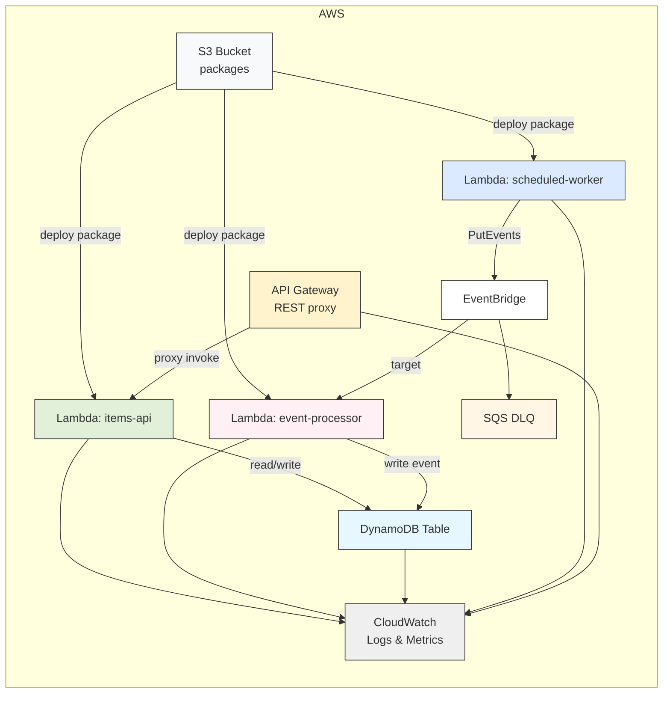

# Architecture & Design

## Diagram (Mermaid)

## Project Structure

- `modules/` — Terraform modules (lambda, api-gateway, dynamodb). These modules
  encapsulate resources and expose variables/outputs.
- `functions/` — Lambda function source code using Node.js 22 ES Modules. Each
  function has a `package.json`, a `build` script, and an optional local test
  runner.
- Root files (`*.tf`) — provider configuration, top-level module wiring (S3,
  IAM, CloudWatch), and orchestration resources (EventBridge, DLQ).
- `.github/workflows/` — CI workflows for Terraform validation, tfsec security
  scanning, Node.js build & tests, and markdown linting.
- `MONITORING.md`, `EVENTBRIDGE.md`, `ARCHITECTURE.md`, `DELIVERABLES.md` —
  documentation, design choices, and deliverables mapping.

## Design Decisions

 - Modular Terraform: Modules for Lambda, API Gateway, and DynamoDB keep code
   reusable, testable, and easy to reason about. Modules expose only the
   required inputs and well-defined outputs.
 - Variables & Validation: Use input validation (e.g., name length, allowed
   regions) to catch configuration mistakes early.
 - CI without AWS credentials: Workflows run `terraform init -backend=false`
   and `terraform validate` so checks run on PRs without needing secrets. The
   Node.js steps build and run lightweight local tests.
  - Node.js 22 with ES Modules per the assignment.
  - Structured JSON logging (`{ level, message, ... }`) to simplify Log
    Insights and metric extraction.
  - Lightweight local tests that set `LOCAL_TEST=1` to avoid requiring AWS
    resources locally.
  - Environment variables are passed via module inputs for name/ARNS and the
    DynamoDB table name.
 - Security: IAM follows least-privilege principles. Policies target specific
   resources (e.g., DynamoDB table ARN) where possible. EventBridge publish
   permission is scoped to functions that need it.
  - CloudWatch Dashboard consolidates Lambda, API Gateway, and DynamoDB metrics.
  - Alarms created for Errors, Duration, Throttles, 5XX, and DynamoDB throttles.
    These alarms are configured with conservative defaults (documented in
    `MONITORING.md`).
  - Log metric filters extract `ERROR` from structured logs to drive alerting
    and measurement.
 - Observability:
   - CloudWatch Dashboard consolidates Lambda, API Gateway, and DynamoDB
     metrics.
   - Alarms created for Errors, Duration, Throttles, 5XX, and DynamoDB throttles
     with conservative defaults (documented in `MONITORING.md`).
   - Log metric filters extract `ERROR` from structured logs to drive alerting
     and measurement.
  - Scheduled worker publishes application events to EventBridge. An
    event-processor consumes and stores those events in DynamoDB.
  - A Dead-Letter Queue (SQS) captures failed event deliveries and has a
    monitoring alarm for messages.
  - Design supports retries via EventBridge/SQS and enables manual or
    automated DLQ processing later.

## How to use the Diagram

 - GitHub renders Mermaid diagrams in Markdown. Open `ARCHITECTURE.md` on GitHub
   or a supported editor to view the diagram.
 - For ASCII/printable formats, the Mermaid block can be converted using `mmdc`
   (Mermaid CLI) to an SVG or PNG if desired.

## Rationale Summary

- Aim for clarity and maintainability: modules and small focused functions.
 - Favor observable, defensible defaults: logging, alarms, and dashboards are
   included to make the system production-ready.
 - Build in reliability: DLQ for events, alarm monitoring for operational
   visibility, and modularization to allow independent changes and tests.

If you want, I can also add a generated SVG/PDF diagram artifact or a short PNG
for README display — which format do you prefer?
